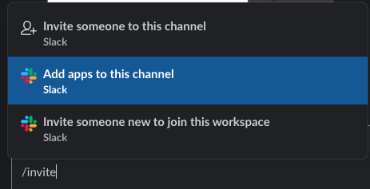
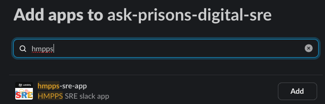

# Migrating security scans from CircleCI to Github Actions

- [Introduction](#introduction)
- [Requirements](#requirements)
- [Automated Process](#the-easy-automated-process)
- [Scripts](#scripts)


## Introduction

Periodic (so non-pipeline) security scans have, for a long while, been run by CircleCI. In a number of projects, the
`.circleci/config.yml` file contains a list of jobs that are instigated on a schedule.

It's now possible to run scans and upload them (when appropriate) to the Code Scanning section of the repo and send a Slack notification using Github actions.

This document details how to move over from CircleCI for each scan and what files and configurations are required.

The security workflows in the [Typescript](https://github.com/ministryofjustice/hmpps-template-typescript/tree/main/.github/workflows) and [Kotlin](https://github.com/ministryofjustice/hmpps-template-kotlin/tree/main/.github/workflows) template projects are used as the basis of the security scans, since they will represent the most recent configurations.

## Requirements

### Common components

Currently the only common component that's required for all action is the **Security Alerts Slack Channel ID**.

This needs to be added to the Actions variables of the project's Github repository, with the name **`SECURITY_ALERTS_SLACK_CHANNEL_ID`**, and the appropriate Slack channel ID as the value.
Note that this should be the channel ID, as reported at the bottom of _View channel details_ and not the channel name as the channel could be renamed at a later stage.

If the channel is private, the **HMPPS SRE App Slack bot** then needs to be invited to the channel - using `/invite`, select "Add apps to this
channel", and look for **hmpps-sre-app**. Click 'Add' - this will enable messages to be sent by the bot.




**Note:** if the Slack Channel ID variable is empty, no slack messages will be sent within any of these workflows below.
Only failed workflow emails will be sent (Veracode scans and code scanning uploads will continue).

## The easy automated process

This is the recommended way to update security jobs. What you need to do:

- check out [hmpps-github-actions](https://github.com/ministryofjustice/hmpps-github-actions) into the same parent folder as your project.

- For kotlin projects you can run:
```
/bin/bash -c ../hmpps-github-actions/recreate-kotlin-security-jobs.bash
```
from your cloned Github repository.

- For typescript projects you can run:
```
/bin/bash -c ../hmpps-github-actions/recreate-typescript-security-jobs.bash
```

Alternatively you can run this from a checked out repo:
```
/bin/bash -c "$(curl -fsSL https://github.com/ministryofjustice/hmpps-github-actions/raw/refs/heads/main/migrate-repo.sh)
```

For more information about how it works, see the 'Scripts' section below.

## Scripts

### ***security_trivy***

#### What to comment out:

within `.circleci/config.yml` of the target project, comment out or remove the following:

```
      - hmpps/trivy_latest_scan:
          slack_channel: << pipeline.parameters.alerts-slack-channel >>
          context:
            - hmpps-common-vars
```

#### What to add

From this repo, copy:

- from `templates/workflows/security_trivy.yml`
- to `.github/workflows/security_trivy.yml` in the target project.

#### Outputs

If the workflow runs successfully, and the scan identifies issues:

- Trivy automatically creates a Sarif file which gets uploaded to Github, and generates an open alert for each item,
  within Code Scanning

- It will also send a Slack message to notify that the workflow has identified issues, and links to Code Scanning for
  that repository.

If the workfow fails, Github sends a slack message and an email to notify users.

### ***security_owasp***

#### What to comment out:

within `.circleci/config.yml` of the target project, comment out or remove the following:

```
      - hmpps/gradle_owasp_dependency_check:
          cache_key: "v2_0"
          jdk_tag: "21.0"
          slack_channel: << pipeline.parameters.alerts-slack-channel >>
          context:
            - hmpps-common-vars
```

#### What to add

From this repo, copy:

- from `.github/workflows/security_owasp.yml` in the template project
- to `.github/workflows/security_owasp.yml` in the target project.

#### Outputs

If the workflow runs successfully, and the scan identifies issues:

- OWASP automatically creates a Sarif file which gets uploaded to Github, and generates an open alert for each item,
  within Code Scanning

- It will also send a Slack message to notify that the workflow has identified issues, and links to Code Scanning for
  that repository.

If the workfow fails, Github sends a slack message and an email to notify users.

### ***security_npm_dependency***

#### What to comment out:

within `.circleci/config.yml` of the target project, comment out or remove the following:

```
     - hmpps/npm_security_audit:
         slack_channel: << pipeline.parameters.alerts-slack-channel >>
         node_tag: << pipeline.parameters.node-version >>
         context:
           - hmpps-common-vars
```

#### What to add

From this repo, copy:

- from `.github/workflows/security_npm_dependency.yml` in the template project
- to `.github/workflows/security_npm_dependency.yml` of the target project.

#### Outputs

If the workflow runs successfully, and the scan identifies issues:

- The workflow runs a script to translate the json response into SARIF format and uploads it to Code Scanning

- It will also send a Slack message to notify that the workflow has identified issues, and links to Code Scanning for
  that repository.

- The Slack message will also display a table of the vunerable components.

If the workfow fails, Github sends a slack message and an email to notify users.

### ***security_veracode_pipeline_scan***

#### What to comment out:

within `.circleci/config.yml` of the target project, comment out or remove the following:

```
  - hmpps/veracode_pipeline_scan:
      slack_channel: << pipeline.parameters.alerts-slack-channel >>
        context:
          - veracode-credentials
          - hmpps-common-vars
```

#### What to add

From this repo, copy:

- from `.github/workflows/security_veracode_pipeline_scan.yml` in the template project
- to `.github/workflows/security_veracode_pipeline_scan.yml` in the target project.

To ensure all the scans don't run at the same time, please change the time of this scan.

#### Outputs

Veracode processes the reports, which are ultimately made available in
the [Developer Portal](https://developer-portal.hmpps.service.justice.gov.uk/reports/veracode).

If the workfow fails, Github sends a slack message and an email to notify users.

### ***security_veracode_policy_scan***

#### What to comment out:

within `.circleci/config.yml` of the target project, comment out or remove the following:

```
security-weekly:
    triggers:
      - schedule:
          cron: "50 3 * * 1"
          filters:
            branches:
              only:
                - main
    jobs:
      - hmpps/veracode_policy_scan:
          slack_channel: << pipeline.parameters.alerts-slack-channel >>
          context:
            - veracode-credentials
            - hmpps-common-vars

```

#### What to add

From this repo, copy:

- from `.github/workflows/security_veracode_policy_scan.yml` in the template project
- to `.github/workflows/security_veracode_policy_scan.yml` in the target project

To ensure all the scans don't run at the same time, please change the time of this scan.

#### Outputs

Veracode processes the reports, which are ultimately made available in
the [Developer Portal](https://developer-portal.hmpps.service.justice.gov.uk/reports/veracode).

If the workfow fails, Github sends a slack message and an email to notify users.


### TODO:

- Update the bootstrap to change the random time value from making changes within config.yml to the specific github
  actions
- Update the bootstrap to add SECURITY_ALERTS_SLACK_CHANNEL_ID to the repo based on Service Catalogue configuration
- Optionally create a Github issue (and notify) when a code scan identifies a vulnerability - as
  per [this project](https://github.com/ministryofjustice/hmpps-probation-integration-services/blob/main/.github/workflows/security.yml)

---

### security_npm_outdated

*(note: generally only used on the templates project)*

#### What to comment out:

within `.circleci/config.yml` of the target project, comment out or remove the following:

```
     - hmpps/npm_outdated:
         slack_channel: << pipeline.parameters.alerts-slack-channel >>
         node_tag: << pipeline.parameters.node-version >>
         context:
           - hmpps-common-vars
```

#### What to add

From this repo, copy:

- from `templates/workflows/security_npm_outdated.yml`
- to `.github/workflows/security_npm_outdated.yml` of the target project.

#### Outputs

If the workflow runs successfully, and the scan identifies issues:

- A text file is uploaded which gets uploaded to Github as an Action artifact

- It will also send a Slack message to notify that the workflow has identified issues, along with a table of the
  outdated components.

If the workfow fails, Github sends a slack message and an email to notify users.
